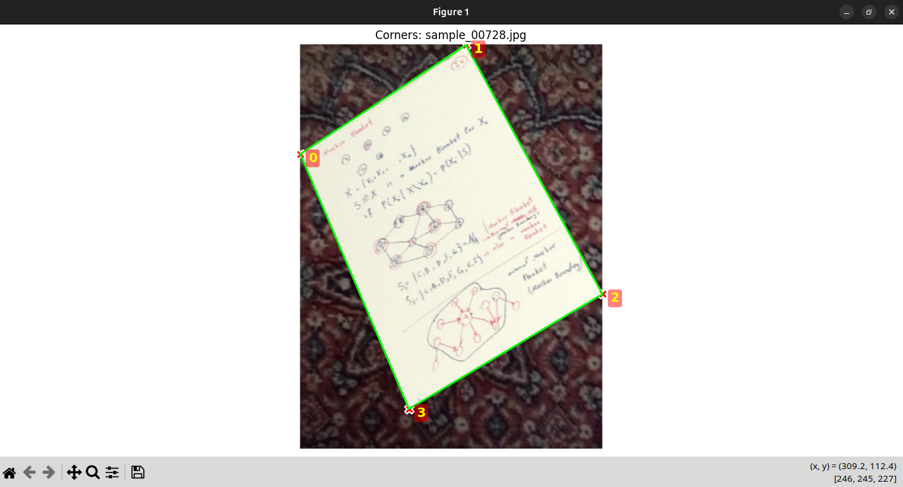
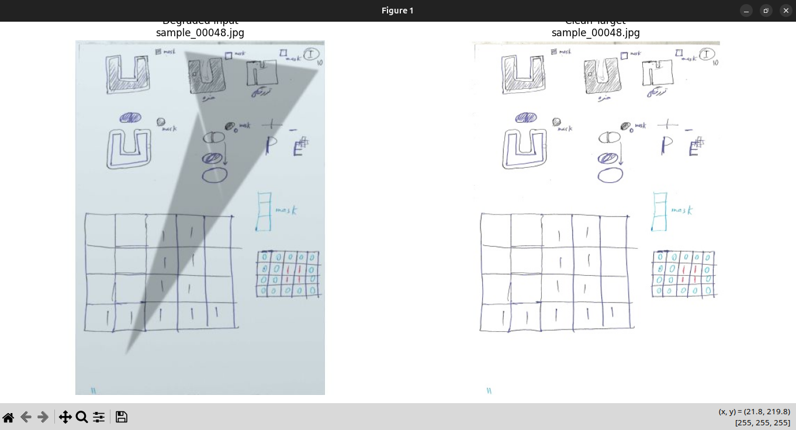
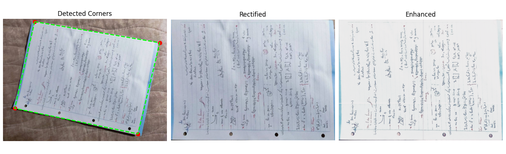
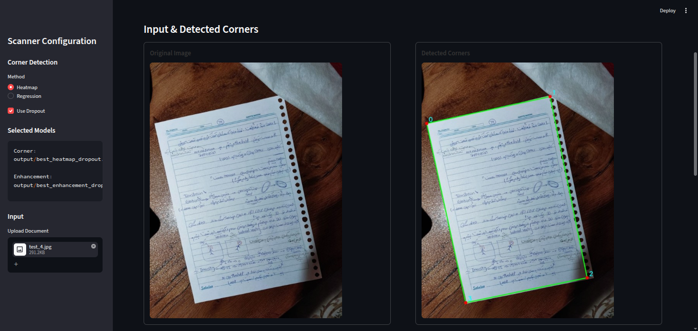
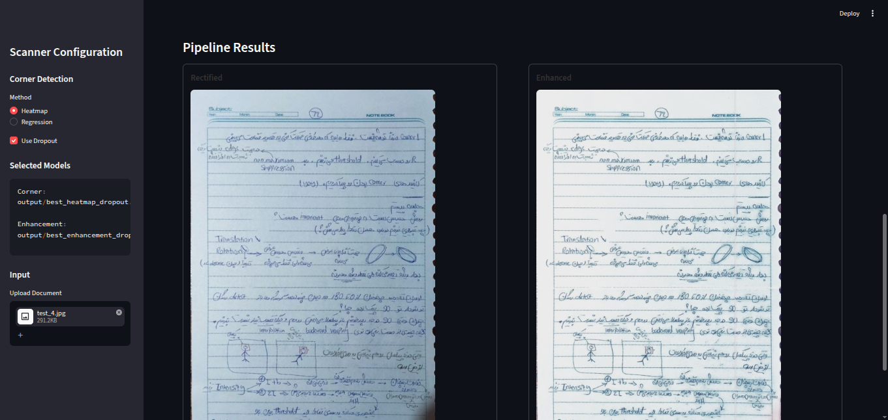

# Document Scanning Enhancement

## Table of Contents

- [Overview](#overview)
- [Main Features](#main-features)
- [Project Workflow](#project-workflow)
- [Project Structure](#project-structure)
- [Dataset Generation](#1-dataset-generation)
- [Precompute Corner Dataset](#2-precompute-corner-dataset)
- [Precompute Enhancement Dataset](#3-precompute-enhancement-dataset)
- [Visualize the Generated Dataset](#4-visualize-the-generated-dataset)
- [Understanding the Corner Dataset](#5-understanding-the-corner-dataset)
- [Heatmap Generation](#6-heatmap-generation)
- [Corner Detection Models](#7-corner-detection-models)
- [Direct Coordinate Regression](#71-direct-coordinate-regression)
- [Heatmap Corner Detection](#8-heatmap-corner-detection)
- [Why Heatmaps Are Used](#9-why-heatmaps-are-used)
- [Training the Corner Models](#10-training-the-corner-models)
- [Direct Regression Training](#11-direct-regression-training)
- [Enhancement Model](#12-enhancement-model)
- [Training the Enhancement Model](#13-training-the-enhancement-model)
- [Corner Detection Pipeline](#14-corner-detection-pipeline)
- [Perspective Rectification](#15-perspective-rectification)
- [Enhancement Pipeline](#16-enhancement-pipeline)
- [Complete End-to-End Pipeline](#17-complete-end-to-end-pipeline)
- [Final Result Image](#18-final-result-image)
- [Evaluation](#19-evaluation)
- [Comparing Heatmap and Regression](#20-comparing-heatmap-and-regression)
- [Real Photo Evaluation](#21-real-photo-evaluation)
- [Standalone Inference](#22-standalone-inference)
- [Streamlit Application](#23-streamlit-application)
- [Streamlit Application Workflow](#24-streamlit-application-workflow)
- [Streamlit Output](#25-streamlit-output)
- [Example Streamlit Result](#26-example-streamlit-result)
- [Training and Inference Workflow](#27-training-and-inference-workflow)
- [Model Outputs](#28-model-outputs)
- [Dependencies](#29-dependencies)
- [Installation](#30-installation)
- [Recommended Experiment Order](#31-recommended-experiment-order)
- [Final Result](#32-final-result)
- [Conclusion](#33-conclusion)

    # Overview

    Taking a photograph of a document is different from scanning it.

    A real photograph may contain:

    - Perspective distortion
    - Rotation
    - Uneven lighting
    - Shadows
    - Blur
    - Sensor noise
    - JPEG compression
    - Background surfaces
    - Different document orientations

    The goal of this project is to transform such a photograph into a clean, scan-like document.

    The overall pipeline is:

    ```text
    Input Photograph
           │
           ▼
    Corner Detection
           │
           ▼
    Four Document Corners
           │
           ▼
    Perspective Transformation
           │
           ▼
    Rectified Document
           │
           ▼
    Document Enhancement
           │
           ▼
    Final Enhanced Scan

------------------------------------------------------------------------

# Main Features

-   Synthetic dataset generation without manual corner annotation
-   Perspective-aware document corner detection
-   Heatmap-based corner localization
-   Direct coordinate regression baseline
-   Document perspective rectification
-   Image enhancement using a neural network
-   Shadow and illumination degradation simulation
-   Blur and noise simulation
-   JPEG compression simulation
-   Resolution degradation simulation
-   Dataset visualization
-   Model comparison
-   Standalone inference pipelines
-   Interactive Streamlit application
-   PyTorch-based training and inference

------------------------------------------------------------------------

# Project Workflow

The project should be used in the following order:

    1. Precompute Dataset
            ↓
    2. Visualize Dataset
            ↓
    3. Dataset and Models
            ↓
    4. Train Corner Detection Models
            ↓
    5. Train Enhancement Model
            ↓
    6. Evaluate and Compare Models
            ↓
    7. Test Individual Pipelines
            ↓
    8. Run Complete Pipeline
            ↓
    9. Use Streamlit Application

This order is important because the training scripts expect the
precomputed datasets to already exist.

------------------------------------------------------------------------

# Project Structure

    project/
    │
    ├── data/
    │   ├── dataset/
    │   │   └── Clean document scans
    │   │
    │   ├── background/
    │   │   └── Background photographs
    │   │
    │   ├── precomputed_corners/
    │   │   ├── inputs/
    │   │   └── labels.json
    │   │
    │   └── precomputed_enhancements/
    │       ├── inputs/
    │       └── targets/
    │
    ├── output/
    │   ├── best_heatmap_dropout.pth
    │   ├── best_heatmap_nodrop.pth
    │   ├── best_reg_dropout.pth
    │   ├── best_reg_nodrop.pth
    │   ├── best_enhancement_nodrop.pth
    │   ├── best_enhancement_dropout.pth
    │   ├── metrics
    │   └── other evaluation results
    │
    └── src/
        │
        ├── dataset_corners.py
        ├── model_corners.py
        ├── precompute_corners.py
        ├── train_corner_heatmap.py
        ├── train_corner_regression.py
        │
        ├── dataset_enhancement.py
        ├── model_enhancement.py
        ├── precompute_enhancement.py
        ├── train_enhancement.py
        │
        ├── pipeline_corners.py
        ├── pipeline_enhancement.py
        ├── pipeline_end_to_end.py
        │
        ├── visualize.py
        ├── compare_results.py
        ├── evaluate.py
        ├── evaluate_real_photos.py
        │
        └── app.py

------------------------------------------------------------------------

# 1. Dataset Generation

Before training any model, the required datasets must be generated.

The project does not require manually labeling every generated training
image.

Instead, synthetic training samples are created automatically.

The basic idea is:

    Clean Document
          +
    Background Image
          +
    Random Perspective
          +
    Lighting Changes
          +
    Shadows
          +
    Resolution Loss
          +
    Blur
          +
    Noise
          +
    JPEG Compression
          │
          ▼
    Synthetic Training Sample

The exact document corner coordinates are known because the document is
synthetically placed onto the background.

This allows the project to automatically generate both:

-   Input images
-   Ground-truth corner coordinates

------------------------------------------------------------------------

# 2. Precompute Corner Dataset

The first script that should be executed is:

    python src/precompute_corners.py

This script generates the synthetic dataset used to train the corner
detection models.

The script:

1.  Loads clean document scans from `data/train`
2.  Loads background images from `data/background`
3.  Randomly selects a document scale
4.  Randomly rotates the document
5.  Applies random perspective distortion
6.  Places the document on the background
7.  Applies lighting variations
8.  Generates shadows and gradients
9.  Applies resolution degradation
10. Applies blur
11. Adds noise
12. Applies JPEG compression
13. Resizes the result to `512 × 512`
14. Stores the corresponding normalized corner coordinates

The resulting structure is:

    data/precomputed_corners/

    ├── inputs/
    │   ├── sample_00000.jpg
    │   ├── sample_00001.jpg
    │   ├── sample_00002.jpg
    │   └── ...
    │
    └── labels.json

The `labels.json` file contains the four normalized document corners for
every generated image.

Each image has four points:

    [
        [x1, y1],
        [x2, y2],
        [x3, y3],
        [x4, y4]
    ]

The coordinates are normalized to:

    0.0 → 1.0

------------------------------------------------------------------------

# 3. Precompute Enhancement Dataset

The enhancement model requires a different type of training data.

The enhancement dataset contains:

    Degraded Document
           │
           │
           ▼
    Enhancement Model
           │
           ▼
    Clean Document

The degraded image contains effects such as:

-   Shadows
-   Uneven illumination
-   Blur
-   Noise
-   Resolution loss
-   Color variation
-   JPEG compression

The clean image acts as the ground truth.

Generate this dataset using:

    python src/precompute_enhancement.py

The resulting dataset contains degraded inputs and their corresponding
clean targets.

------------------------------------------------------------------------

# 4. Visualize the Generated Dataset

After generating the datasets, the next step should be visualization.

Run:

    python src/visualize.py

The purpose of this step is to verify that the synthetic dataset looks
realistic enough before starting training.

This is an important step.

If the generated images do not resemble realistic document photographs,
the neural networks will learn unrealistic patterns.

The visualization should be used to inspect:

-   Document placement
-   Perspective distortion
-   Corner locations
-   Shadows
-   Lighting gradients
-   Blur
-   Noise
-   Background variation
-   Overall image quality

------------------------------------------------------------------------

## Dataset Visualization

<p align="center">
  
</p>
<p align="center">
  
</p>

------------------------------------------------------------------------

# 5. Understanding the Corner Dataset

The corner detection dataset is based on images and their corresponding
four document corners.

Each training sample contains:

    Input Image
         │
         └── 512 × 512 × 3

    Ground Truth
         │
         └── 4 × 2 normalized coordinates

For example:

    [
        [x1, y1],
        [x2, y2],
        [x3, y3],
        [x4, y4]
    ]

where every coordinate is normalized between `0` and `1`.

For the heatmap model, these coordinates are converted into four
Gaussian heatmaps.

Therefore:

    4 corners
         ↓
    4 heatmaps
         ↓
    256 × 256

The heatmap size is smaller than the input image because the U-Net
architecture downsamples the input and reconstructs a spatial
representation.

------------------------------------------------------------------------

# 6. Heatmap Generation

The `HeatmapCornerDataset` class in:

    src/dataset_corners.py

generates one heatmap for each document corner.

Conceptually:

    Ground Truth Corner
            │
            ▼
    Gaussian Distribution
            │
            ▼
    Corner Heatmap

A corner located at:

    (x, y)

creates a Gaussian peak around that location.

The center of the Gaussian represents the most likely position of the
corner.

------------------------------------------------------------------------

# 7. Corner Detection Models

The project implements two different corner detection architectures.

------------------------------------------------------------------------

## 7.1 Direct Coordinate Regression

The first model is:

    CornerDirectRegressor

defined in:

    src/model_corners.py

The model directly predicts eight values:

    x1 y1
    x2 y2
    x3 y3
    x4 y4

Architecture:

    Input Image
         │
         ▼
    Convolution Blocks
         │
         ▼
    Feature Extraction
         │
         ▼
    Adaptive Average Pooling
         │
         ▼
    Fully Connected Layers
         │
         ▼
    8 Values
         │
         ▼
    4 Corner Coordinates

The final layer uses a sigmoid activation, therefore the predicted
coordinates are normalized between `0` and `1`.

------------------------------------------------------------------------

# 8. Heatmap Corner Detection

The second and main corner detection model is:

    CornerHeatmapUNet

The model is a U-Net-like architecture.

Its output contains four channels:

    Input
      │
      ▼
    Encoder
      │
      ├── Feature extraction
      ├── Downsampling
      └── Context extraction
      │
      ▼
    Decoder
      │
      ├── Upsampling
      └── Skip connections
      │
      ▼
    4 Heatmaps

Each output channel corresponds to one document corner.

The corner coordinates are then extracted from the heatmaps using a
spatial softmax / expected coordinate calculation.

------------------------------------------------------------------------

# 9. Why Heatmaps Are Used

Direct coordinate regression asks the network:

    "What are the exact x and y coordinates?"

The heatmap model instead asks:

    "Where is the probability distribution of this corner?"

This preserves spatial information throughout the prediction.

For document corner detection, this can be advantageous because the task
is fundamentally spatial.

The project therefore evaluates both approaches and compares their
localization error.

------------------------------------------------------------------------

# 10. Training the Corner Models

After generating and visualizing the dataset, the corner models can be
trained.

## Heatmap Model

Run:

    python src/train_corner_heatmap.py

For example:

    python src/train_corner_heatmap.py \
        --epochs 30 \
        --batch_size 8 \
        --img_size 512 \
        --heatmap_size 256 \
        --sigma 7.0 \
        --lr 1e-3

To enable dropout:

    python src/train_corner_heatmap.py \
        --epochs 30 \
        --batch_size 8 \
        --use_dropout

The training script:

-   Loads `HeatmapCornerDataset`
-   Splits the dataset into train/validation/test sets
-   Trains `CornerHeatmapUNet`
-   Uses weighted BCE loss
-   Evaluates validation performance
-   Uses a learning-rate scheduler
-   Saves the best model
-   Calculates pixel-level corner error

------------------------------------------------------------------------

# 11. Direct Regression Training

The regression model can be trained using:

    python src/train_corner_regression.py

Example:

    python src/train_corner_regression.py \
        --epochs 30 \
        --batch_size 8 \
        --img_size 512 \
        --lr 1e-3

Dropout can also be enabled if supported by the selected training
configuration.

The regression model is mainly used as a baseline for comparison against
the heatmap approach.

------------------------------------------------------------------------

# 12. Enhancement Model

After corner detection, the document needs to be rectified and enhanced.

The enhancement model is implemented in:

    src/model_enhancement.py

The model uses an encoder-decoder architecture similar to U-Net.

Conceptually:

    Degraded Rectified Document
                 │
                 ▼
              Encoder
                 │
                 ▼
           Feature Representation
                 │
                 ▼
              Decoder
                 │
                 ▼
          Enhanced Document

The network learns to map:

    Degraded Image → Clean Image

while preserving important document details such as:

-   Text
-   Lines
-   Characters
-   Edges
-   Document structure

------------------------------------------------------------------------

# 13. Training the Enhancement Model

First generate the enhancement dataset:

    python src/precompute_enhancement.py

Then train the enhancement network:

    python src/train_enhancement.py

For example:

    python src/train_enhancement.py \
        --epochs 20 \
        --batch_size 16

The training process compares the generated enhanced image against the
clean target.

The objective is to remove degradations while preserving document
content.

------------------------------------------------------------------------

# 14. Corner Detection Pipeline

The corner detection process can be tested independently.

The relevant pipeline is:

    src/pipeline_corners.py

This pipeline is responsible for:

1.  Loading an input photograph
2.  Preprocessing the image
3.  Running the corner detection model
4.  Extracting four corner coordinates
5.  Visualizing the detected corners

A typical result looks like:

    Input Photograph
           │
           ▼
    CornerHeatmapUNet
           │
           ▼
    4 Detected Corners

------------------------------------------------------------------------

# 15. Perspective Rectification

Once the four corners are detected, the document can be transformed into
a frontal view.

The process is:

    Detected Corners
           │
           ▼
    Perspective Transform
           │
           ▼
    Rectified Document

The four detected points define the source quadrilateral.

A perspective transformation then maps this quadrilateral into a
rectangular document.

This removes:

-   Rotation
-   Perspective distortion
-   Camera angle distortion

------------------------------------------------------------------------

# 16. Enhancement Pipeline

The enhancement process is implemented separately in:

    src/pipeline_enhancement.py

It takes the rectified document and processes it using the trained
enhancement model.

Conceptually:

    Rectified Document
            │
            ▼
    Enhancement Model
            │
            ▼
    Enhanced Document

The goal is to improve readability and produce a scan-like result.

------------------------------------------------------------------------

# 17. Complete End-to-End Pipeline

The complete pipeline combines the two main stages:

                     INPUT PHOTO
                          │
                          ▼
                 Corner Detection
                          │
                          ▼
                  4 Document Corners
                          │
                          ▼
              Perspective Transformation
                          │
                          ▼
                 Rectified Document
                          │
                          ▼
               Enhancement Network
                          │
                          ▼
                  Enhanced Document

The complete inference pipeline is implemented in:

    src/pipeline_end_to_end.py

This is the most important pipeline for demonstrating the final
functionality of the project.

------------------------------------------------------------------------

# 18. Final Result Image

<p align="center">
  
</p>
------------------------------------------------------------------------

# 19. Evaluation

The project contains several evaluation and comparison utilities.

The main evaluation scripts are:

    src/evaluate.py
    src/evaluate_real_photos.py
    src/compare_results.py

------------------------------------------------------------------------

## Corner Error

Corner detection can be evaluated using pixel-level Euclidean error.

For every predicted corner:

    Error = distance(predicted_corner, ground_truth_corner)

The average error is then reported in pixels.

The project reports:

    Train Error
    Validation Error
    Test Error

This makes it possible to compare the generalization performance of the
corner detector.

------------------------------------------------------------------------

# 20. Comparing Heatmap and Regression

The project contains two corner detection approaches:

    CornerDirectRegressor
    CornerHeatmapUNet

`compare_results.py` can be used to analyze the performance of different
model configurations.

The comparison can include:

-   Heatmap vs Regression
-   Dropout vs No Dropout
-   Training error
-   Validation error
-   Test error
-   Other recorded metrics

Run:

    python src/compare_results.py

------------------------------------------------------------------------

# 21. Real Photo Evaluation

The project also includes:

    src/evaluate_real_photos.py

This script is intended for evaluating the system on real photographs
rather than only synthetic training samples.

This is important because the final goal is to work on real-world
document photographs.

A model that performs well on synthetic data should therefore also be
tested against photographs captured using real cameras or phones.

------------------------------------------------------------------------

# 22. Standalone Inference

The project provides standalone pipeline scripts so that individual
stages can be tested independently.

### Corner Detection

    pipeline_corners.py

Responsible for:

    Image → Corner Detection → Four Corners

### Enhancement

    pipeline_enhancement.py

Responsible for:

    Rectified Image → Enhancement → Enhanced Image

### Full Pipeline

    pipeline_end_to_end.py

Responsible for:

    Image
      ↓
    Corners
      ↓
    Rectification
      ↓
    Enhancement
      ↓
    Final Result

These scripts are useful for debugging because each stage can be tested
separately before running the complete system.

------------------------------------------------------------------------

# 23. Streamlit Application

The project also includes an interactive web application:

    src/app.py

The application is built using Streamlit.

Run:

    streamlit run src/app.py

After starting the application, Streamlit provides a local URL, usually:

    http://localhost:8501

The application allows the user to upload a document photograph and run
the scanning pipeline interactively.

------------------------------------------------------------------------

# 24. Streamlit Application Workflow

The application follows the same pipeline as the command-line version:

    Upload Image
          │
          ▼
    Corner Detection
          │
          ▼
    Detected Corners
          │
          ▼
    Perspective Correction
          │
          ▼
    Rectified Image
          │
          ▼
    Enhancement
          │
          ▼
    Final Enhanced Image

The application makes it possible to visually inspect the intermediate
results instead of only receiving numerical coordinates.

------------------------------------------------------------------------

# 25. Streamlit Output

The application should ideally display the main stages of the pipeline:

    Original Image
           │
           ├── Detected Corners
           │
           ├── Rectified Image
           │
           └── Enhanced Image

This allows the user to understand not only the final output, but also
how the system arrived at that output.

------------------------------------------------------------------------

# 26. Example Streamlit Result

<p align="center">
  
</p>
<p align="center">
  
</p>

------------------------------------------------------------------------

# 27. Training and Inference Workflow

A complete setup can be summarized as follows.

## Step 1 --- Prepare Data

Place clean document scans in:

    data/train/

and background photographs in:

    data/background/

------------------------------------------------------------------------

## Step 2 --- Generate Corner Dataset

    python src/precompute_corners.py

------------------------------------------------------------------------

## Step 3 --- Generate Enhancement Dataset

    python src/precompute_enhancement.py

------------------------------------------------------------------------

## Step 4 --- Visualize the Datasets

    python src/visualize.py

Verify that the generated images contain realistic:

-   Perspective distortion
-   Shadows
-   Lighting changes
-   Blur
-   Noise
-   Backgrounds

------------------------------------------------------------------------

## Step 5 --- Train Corner Detector

Heatmap model:

    python src/train_corner_heatmap.py

Regression model:

    python src/train_corner_regression.py

------------------------------------------------------------------------

## Step 6 --- Train Enhancement Model

    python src/train_enhancement.py

------------------------------------------------------------------------

## Step 7 --- Evaluate Models

Run the available evaluation scripts:

    python src/evaluate.py

and:

    python src/compare_results.py

For real photographs:

    python src/evaluate_real_photos.py

------------------------------------------------------------------------

## Step 8 --- Test Individual Pipelines

Test corner detection:

    python src/pipeline_corners.py

Test enhancement:

    python src/pipeline_enhancement.py

------------------------------------------------------------------------

## Step 9 --- Run the Complete Pipeline

    python src/pipeline_end_to_end.py

The final result should follow:

    Original
       ↓
    Corners
       ↓
    Rectified
       ↓
    Enhanced

------------------------------------------------------------------------

## Step 10 --- Run the Web Application

    streamlit run src/app.py

Then upload a real document photograph and inspect the complete result.

------------------------------------------------------------------------

# 28. Model Outputs

The trained models are saved as PyTorch checkpoint files.

Typical examples include:

    output/
    ├── best_heatmap_nodrop.pth
    ├── best_heatmap_dropout.pth
    ├── best_reg_nodrop.pth
    ├── best_reg_dropout.pth
    └── best_enhancement_nodrop.pth
    └── best_enhancement_dropout.pth

The exact files depend on which training configurations were executed.

Evaluation results are stored as JSON files, for example:

    output/
    ├── metrics_heatmap_nodrop.json
    ├── metrics_heatmap_dropout.json
    ├── metrics_reg_nodrop.json
    └── metrics_reg_dropout.json

------------------------------------------------------------------------

# 29. Dependencies

The main dependencies are:

    Python
    PyTorch
    OpenCV
    NumPy
    Matplotlib
    tqdm
    Streamlit
    TorchMetrics
    Kornia

Install the required packages using:

    pip install torch torchvision opencv-python numpy matplotlib tqdm streamlit torchmetrics kornia

If GPU training is required, install a PyTorch version compatible with
the available CUDA environment.

------------------------------------------------------------------------

# 30. Installation

Clone the repository:

    git clone https://github.com/0AliPrs0/document-scanner.git
    cd document-scanner

Create a virtual environment:

    python -m venv venv

Activate it on Linux/macOS:

    source venv/bin/activate

On Windows:

    venv\Scripts\activate

Install dependencies:

    pip install torch torchvision opencv-python numpy matplotlib tqdm streamlit torchmetrics kornia

------------------------------------------------------------------------

# 31. Recommended Experiment Order

For reproducing the project from scratch, use the following order:

                    ┌─────────────────────┐
                    │ Clean Documents      │
                    │ data/train           │
                    └──────────┬──────────┘
                               │
                               ▼
                    ┌─────────────────────┐
                    │ Background Images    │
                    │ data/background      │
                    └──────────┬──────────┘
                               │
                               ▼
                    ┌─────────────────────┐
                    │ Precompute Scripts   │
                    └──────────┬──────────┘
                               │
                               ▼
                    ┌─────────────────────┐
                    │ Generated Datasets   │
                    └──────────┬──────────┘
                               │
                               ▼
                    ┌─────────────────────┐
                    │ Dataset Visualization│
                    └──────────┬──────────┘
                               │
                               ▼
                  ┌────────────┴────────────┐
                  │                         │
                  ▼                         ▼
         Corner Detection            Enhancement
            Training                   Training
                  │                         │
                  ▼                         ▼
           Corner Weights             Enhancement
                                      Weights
                  │                         │
                  └────────────┬────────────┘
                               │
                               ▼
                    ┌─────────────────────┐
                    │ Complete Pipeline    │
                    └──────────┬──────────┘
                               │
                               ▼
                    ┌─────────────────────┐
                    │ Streamlit App        │
                    └─────────────────────┘

------------------------------------------------------------------------

# 32. Final Result

The final system is capable of transforming a real photograph such as:

    A document photographed at an angle

into:

    Detected document corners
            ↓
    Perspective-corrected document
            ↓
    Enhanced scan-like document

The complete system therefore combines computer vision and deep learning
into a single document scanning pipeline.

------------------------------------------------------------------------

# 33. Conclusion

This project implements a complete AI-based document scanning pipeline.

Instead of relying on manually labeled corner datasets, the project
generates synthetic training data by combining clean document scans with
real background images and controlled degradations.

Two corner detection approaches are implemented and evaluated:

    CornerDirectRegressor
    CornerHeatmapUNet

The detected document corners are then used for perspective correction.

Finally, the rectified document is passed through an enhancement network
to produce a cleaner and more readable result.

The complete workflow is:

    Synthetic Data Generation
              ↓
    Dataset Visualization
              ↓
    Corner Detection Training
              ↓
    Enhancement Training
              ↓
    Model Evaluation
              ↓
    Corner Detection
              ↓
    Perspective Rectification
              ↓
    Document Enhancement
              ↓
    Final Scan

The project also provides standalone inference pipelines and an
interactive Streamlit application for testing the complete system on
real document photographs.

